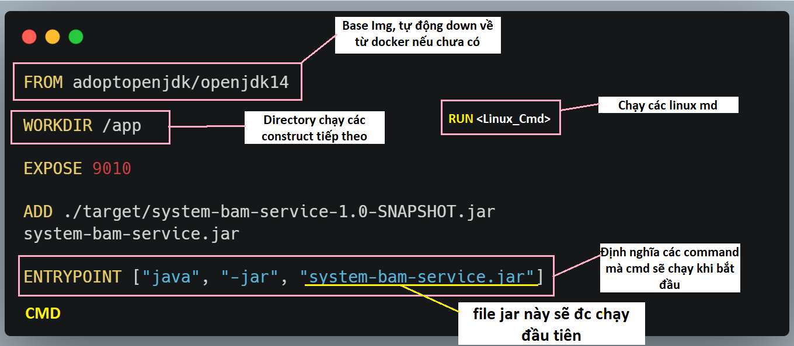
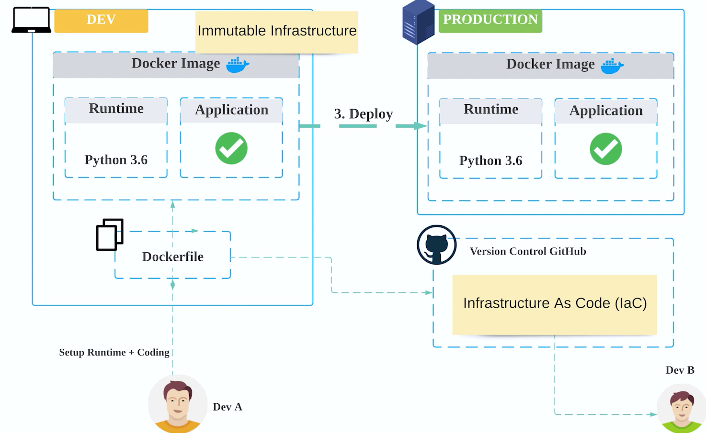

# DOCKER

---

## 1. Các lệnh docker cơ bản

- `docker ps` : xem container đang chạy, chạy port nào.
- `docker run <tên_container>` : pull/run image
- `docker build` : build ra 1 image
- `docker push` : đưa 1 img publish (quản lý ở docker hub)
- `docker image ls` : liệt kê các images.
- `docker inspect image <tên_docker_image>` : thông tin chi tiết của 1 image
- `docker container ls` : liệt kê các container đang chạy
- `docker container ls -a`: liệt kê tất cả container (đang chạy / dừng)
- `docker container start <tên_container>`: chạy 1 container đang dừng

## 2. Các thành phần chính của docker:

a. **Docker file**:


Best practices:

- `RUN <command>` : Mỗi lệnh `RUN` sẽ tạo ra 1 image layer --> Nên gộp các lệnh lại thành 1 lệnh `RUN` để tối ưu thời gian build image, size của image: `RUN <command_1> \ <command_2> \ <command_3> ...`
- `COPY <src_dir> <dst_dir>` : copy file/folder từ host machine vào container
- `ADD <src_dir_OR_url> <dst_dir>` : tương tự `COPY` nhưng có thể tải từ 1 url
- `VOLUME <absolute_path>` : chỉ định 1 directory để lưu trữ dữ liệu trong container
- `EXPOSE <port>` : chỉ định cổng port mà container sẽ dùng

- `CMD [ <executable> , <param_1> , <param_2> ]` : chỉ định command mà container sẽ chạy khi bắt đầu

- `ENTRYPOINT [ <executable> , <param_1> , <param_2> ]` : như `CMD`. Nếu cả `CMD` và `ENTRYOINT` cùng xuất hiện trong **docker file** thì `ENTRYPOINT` là command, `CMD` là params.

b. **Docker image**: được build ra từ **docker file**:
`docker image build -t <tên_image> <vị_trí_lưu_file_image_sau_khi_build> `

c. **Docker container**:

- Cần phải có biến môi trường, cách tạo biếng mtr:
  `export <TÊN_BIẾN>=<GIÁ_TRỊ>`
- Cách chạy container: `docker container run -it -e <BIẾN_ĐẦU_VÀO>=$<BIẾN MÔI TRƯỜNG> -e <BIẾN_ĐẦU_VÀO2>=$<BIẾN MÔI TRƯỜNG2> --name <tên_caontainer>`

# 3. Infrastructure

- Immuatable infrastructure: Đóng gói môi trường thành image, deploy image đó ở môi trường production
  

---

# DOCKER-COMPOSE (Multi-container application)

## 1. Docker-compose.yaml

- file mặc định để **docker-compose** định nghĩa application

- Ví dụ sử dụng **docker-compose**: Application gồm:
  - 1 container wordpress: https://hub.docker.com/_/wordpress
  - 1 container mysql db: https://hub.docker.com/_/mysql

Vì 2 containers này có public trên **docker hub**, nên không cần viết **docker file**. Sẽ chỉ định nghĩa chúng trong **docker-compose.yaml**

```yaml
version: "3" # Version của docker-compose, khuyến khích dùng 3

services: # Khai báo các service
  wordpress:
    image: wordpress:5.6-php7.4 # Image của service, kèm version. (được public trên docker hub)
    environment: # Khai báo các biến môi trường của service
      WORDPRESS_DB_HOST: db
      WORDPRESS_DB_USER: wordpress
      WORDPRESS_DB_PASSWORD: 123456
      WORDPRESS_DB_NAME: wordpress
    volumes: # Khai báo các volume của service, được mount vào container; sẽ không mất đi khi container bị xóa
      - wordpress:/var/www/html
    ports:
      - "8080:80" # Khai báo port của service, sẽ được map sang port của host
    restart: always # Khai báo cách restart container khi container bị down
    depends_on: # Khai báo thứ tự chạy các service, ví dụ ở đây: sẽ chỉ chạy 'wordpress' khi 'db' đã chạy xong
      - db

  db:
    image: mysql:5.7
    environment:
      MYSQL_RANDOM_ROOT_PASSWORD: "1"
      MYSQL_DATABASE: wordpress
      MYSQL_USER: wordpress
      MYSQL_PASSWORD: 123456
    volumes:
      - db:/var/lib/mysql
    restart: always # Khai báo cách restart container khi container bị down

volumes:
  wordpress:
  db:
```

# 2. Các lệnh với Docker-compose:

- `docker-compose up` : chạy file `docker-compose.yaml`

```apache
D:\Documents\PK's_Workplace\__FIS__\Fis_Projects\TestDocker\docker-compose-example-app>docker-compose up
Creating network "docker-compose-example-app_default" with the default driver
Creating volume "docker-compose-example-app_wordpress" with default driver
Creating volume "docker-compose-example-app_db" with default driver
Pulling db (mysql:5.7)...
5.7: Pulling from library/mysql
9815334b7810: Pull complete
f85cb6fccbfd: Pull complete
b63612353671: Pull complete
447901201612: Pull complete
9b6bc806cc29: Pull complete
24ec1f4b3b0d: Pull complete
207ed1eb2fd4: Pull complete
27cbde3edd97: Pull complete
0a5aa35cc154: Pull complete
e6c92bf6471b: Pull complete
07b80de0d1af: Pull complete
Digest: sha256:c1bda6ecdbc63d3b0d3a3a3ce195de3dd755c4a0658ed782a16a0682216b9a48
Status: Downloaded newer image for mysql:5.7
Pulling wordpress (wordpress:5.6-php7.4)...
5.6-php7.4: Pulling from library/wordpress
45b42c59be33: Pull complete
366d949cba16: Pull complete
4c65628244f3: Pull complete
79a8e4ec25c6: Pull complete
3512b0c25baf: Pull complete
a983b5b9a384: Pull complete
0def93a72fb4: Pull complete
b463e75d679a: Pull complete
86780b697834: Pull complete
7df64f4812c2: Pull complete
59f175c32a30: Pull complete
5363b603851d: Pull complete
93fcdb189245: Pull complete
c0025acb1755: Pull complete
bcdfe24e9c2c: Pull complete
ee894f64a1fa: Pull complete
47ebdf2b72a5: Pull complete
53fab7d97aa4: Pull complete
90b3aed105ef: Pull complete
d39e54d371f3: Pull complete
Digest: sha256:73cfcbf1e511d760d9fc6c4864aeba1f8c856ba2be333a7d342fd76935055e9d
Status: Downloaded newer image for wordpress:5.6-php7.4
Creating docker-compose-example-app_db_1 ... done
Creating docker-compose-example-app_wordpress_1 ... done
Attaching to docker-compose-example-app_db_1, docker-compose-example-app_wordpress_1
db_1         | 2022-09-18 04:59:24+00:00 [Note] [Entrypoint]: Entrypoint script for MySQL Server 5.7.39-1.el7 started.
db_1         | 2022-09-18 04:59:25+00:00 [Note] [Entrypoint]: Switching to dedicated user 'mysql'
wordpress_1  | WordPress not found in /var/www/html - copying now...
db_1         | 2022-09-18 04:59:25+00:00 [Note] [Entrypoint]: Entrypoint script for MySQL Server 5.7.39-1.el7 started.
db_1         | 2022-09-18 04:59:25+00:00 [Note] [Entrypoint]: Initializing database files
db_1         | 2022-09-18T04:59:25.230511Z 0 [Warning] TIMESTAMP with implicit DEFAULT value is deprecated. Please use --explicit_defaults_for_timestamp server option (see documentation for more details).
db_1         | 2022-09-18T04:59:25.346138Z 0 [Warning] InnoDB: New log files created, LSN=45790
db_1         | 2022-09-18T04:59:25.368766Z 0 [Warning] InnoDB: Creating foreign key constraint system tables.
db_1         | 2022-09-18T04:59:25.373098Z 0 [Warning] No existing UUID has been found, so we assume that this is the first time that this server has been started. Generating a new UUID: aad8626f-370e-11ed-bd3c-0242ac120002.
db_1         | 2022-09-18T04:59:25.374331Z 0 [Warning] Gtid table is not ready to be used. Table 'mysql.gtid_executed' cannot be opened.
db_1         | 2022-09-18T04:59:25.528900Z 0 [Warning] A deprecated TLS version TLSv1 is enabled. Please use TLSv1.2 or higher.
db_1         | 2022-09-18T04:59:25.528929Z 0 [Warning] A deprecated TLS version TLSv1.1 is enabled. Please use TLSv1.2 or higher.
db_1         | 2022-09-18T04:59:25.529252Z 0 [Warning] CA certificate ca.pem is self signed.
db_1         | 2022-09-18T04:59:25.550827Z 1 [Warning] root@localhost is created with an empty password ! Please consider switching off the --initialize-insecure option.
wordpress_1  | Complete! WordPress has been successfully copied to /var/www/html
wordpress_1  | [18-Sep-2022 04:59:26 UTC] PHP Warning:  mysqli::__construct(): (HY000/2002): Connection refused in Standard input code on line 22
wordpress_1  |
wordpress_1  | MySQL Connection Error: (2002) Connection refused
db_1         | 2022-09-18 04:59:27+00:00 [Note] [Entrypoint]: Database files initialized
db_1         | 2022-09-18 04:59:27+00:00 [Note] [Entrypoint]: Starting temporary server
db_1         | 2022-09-18 04:59:27+00:00 [Note] [Entrypoint]: Waiting for server startup
db_1         | 2022-09-18T04:59:27.477402Z 0 [Warning] TIMESTAMP with implicit DEFAULT value is deprecated. Please use --explicit_defaults_for_timestamp server option (see documentation for more details).
db_1         | 2022-09-18T04:59:27.478465Z 0 [Note] mysqld (mysqld 5.7.39) starting as process 125 ...
db_1         | 2022-09-18T04:59:27.481018Z 0 [Note] InnoDB: PUNCH HOLE support available
db_1         | 2022-09-18T04:59:27.481048Z 0 [Note] InnoDB: Mutexes and rw_locks use GCC atomic builtins
db_1         | 2022-09-18T04:59:27.481050Z 0 [Note] InnoDB: Uses event mutexes
db_1         | 2022-09-18T04:59:27.481052Z 0 [Note] InnoDB: GCC builtin __atomic_thread_fence() is used for memory barrier
db_1         | 2022-09-18T04:59:27.481053Z 0 [Note] InnoDB: Compressed tables use zlib 1.2.12
db_1         | 2022-09-18T04:59:27.481054Z 0 [Note] InnoDB: Using Linux native AIO
db_1         | 2022-09-18T04:59:27.481215Z 0 [Note] InnoDB: Number of pools: 1
db_1         | 2022-09-18T04:59:27.481302Z 0 [Note] InnoDB: Using CPU crc32 instructions
db_1         | 2022-09-18T04:59:27.482992Z 0 [Note] InnoDB: Initializing buffer pool, total size = 128M, instances = 1, chunk size = 128M
db_1         | 2022-09-18T04:59:27.489739Z 0 [Note] InnoDB: Completed initialization of buffer pool
db_1         | 2022-09-18T04:59:27.492351Z 0 [Note] InnoDB: If the mysqld execution user is authorized, page cleaner thread priority can be changed. See the man page of setpriority().
db_1         | 2022-09-18T04:59:27.504172Z 0 [Note] InnoDB: Highest supported file format is Barracuda.
db_1         | 2022-09-18T04:59:27.511378Z 0 [Note] InnoDB: Creating shared tablespace for temporary tables
db_1         | 2022-09-18T04:59:27.511527Z 0 [Note] InnoDB: Setting file './ibtmp1' size to 12 MB. Physically writing the file full; Please wait ...
db_1         | 2022-09-18T04:59:27.523603Z 0 [Note] InnoDB: File './ibtmp1' size is now 12 MB.
db_1         | 2022-09-18T04:59:27.524794Z 0 [Note] InnoDB: 96 redo rollback segment(s) found. 96 redo rollback segment(s) are active.
db_1         | 2022-09-18T04:59:27.524851Z 0 [Note] InnoDB: 32 non-redo rollback segment(s) are active.
db_1         | 2022-09-18T04:59:27.526114Z 0 [Note] InnoDB: 5.7.39 started; log sequence number 2754908
db_1         | 2022-09-18T04:59:27.526285Z 0 [Note] InnoDB: Loading buffer pool(s) from /var/lib/mysql/ib_buffer_pool
db_1         | 2022-09-18T04:59:27.526530Z 0 [Note] Plugin 'FEDERATED' is disabled.
db_1         | 2022-09-18T04:59:27.527066Z 0 [Note] InnoDB: Buffer pool(s) load completed at 220918  4:59:27
db_1         | 2022-09-18T04:59:27.531229Z 0 [Note] Found ca.pem, server-cert.pem and server-key.pem in data directory. Trying to enable SSL support using them.
db_1         | 2022-09-18T04:59:27.531260Z 0 [Note] Skipping generation of SSL certificates as certificate files are present in data directory.
db_1         | 2022-09-18T04:59:27.531264Z 0 [Warning] A deprecated TLS version TLSv1 is enabled. Please use TLSv1.2 or higher.
db_1         | 2022-09-18T04:59:27.531266Z 0 [Warning] A deprecated TLS version TLSv1.1 is enabled. Please use TLSv1.2 or higher.
db_1         | 2022-09-18T04:59:27.531717Z 0 [Warning] CA certificate ca.pem is self signed.
db_1         | 2022-09-18T04:59:27.531760Z 0 [Note] Skipping generation of RSA key pair as key files are present in data directory.
db_1         | 2022-09-18T04:59:27.533853Z 0 [Warning] Insecure configuration for --pid-file: Location '/var/run/mysqld' in the path is accessible to all OS users. Consider choosing a different directory.
db_1         | 2022-09-18T04:59:27.538669Z 0 [Note] Event Scheduler: Loaded 0 events
db_1         | 2022-09-18T04:59:27.539015Z 0 [Note] mysqld: ready for connections.
db_1         | Version: '5.7.39'  socket: '/var/run/mysqld/mysqld.sock'  port: 0  MySQL Community Server (GPL)
db_1         | 2022-09-18 04:59:28+00:00 [Note] [Entrypoint]: Temporary server started.
db_1         | '/var/lib/mysql/mysql.sock' -> '/var/run/mysqld/mysqld.sock'
db_1         | Warning: Unable to load '/usr/share/zoneinfo/iso3166.tab' as time zone. Skipping it.
db_1         | Warning: Unable to load '/usr/share/zoneinfo/leapseconds' as time zone. Skipping it.
db_1         | Warning: Unable to load '/usr/share/zoneinfo/tzdata.zi' as time zone. Skipping it.
db_1         | Warning: Unable to load '/usr/share/zoneinfo/zone.tab' as time zone. Skipping it.
db_1         | Warning: Unable to load '/usr/share/zoneinfo/zone1970.tab' as time zone. Skipping it.
db_1         | 2022-09-18 04:59:29+00:00 [Note] [Entrypoint]: GENERATED ROOT PASSWORD: 4YBP65mRXwkfw+zJocV77hgg6vdYZorR
db_1         | 2022-09-18 04:59:29+00:00 [Note] [Entrypoint]: Creating database wordpress
db_1         | 2022-09-18 04:59:29+00:00 [Note] [Entrypoint]: Creating user wordpress
db_1         | 2022-09-18 04:59:29+00:00 [Note] [Entrypoint]: Giving user wordpress access to schema wordpress
db_1         |
db_1         | 2022-09-18 04:59:29+00:00 [Note] [Entrypoint]: Stopping temporary server
db_1         | 2022-09-18T04:59:29.614435Z 0 [Note] Giving 0 client threads a chance to die gracefully
db_1         | 2022-09-18T04:59:29.614466Z 0 [Note] Shutting down slave threads
db_1         | 2022-09-18T04:59:29.614471Z 0 [Note] Forcefully disconnecting 0 remaining clients
db_1         | 2022-09-18T04:59:29.614475Z 0 [Note] Event Scheduler: Purging the queue. 0 events
db_1         | 2022-09-18T04:59:29.614514Z 0 [Note] Binlog end
db_1         | 2022-09-18T04:59:29.615137Z 0 [Note] Shutting down plugin 'ngram'
db_1         | 2022-09-18T04:59:29.615167Z 0 [Note] Shutting down plugin 'partition'
db_1         | 2022-09-18T04:59:29.615170Z 0 [Note] Shutting down plugin 'BLACKHOLE'
db_1         | 2022-09-18T04:59:29.615172Z 0 [Note] Shutting down plugin 'ARCHIVE'
db_1         | 2022-09-18T04:59:29.615189Z 0 [Note] Shutting down plugin 'PERFORMANCE_SCHEMA'
db_1         | 2022-09-18T04:59:29.615206Z 0 [Note] Shutting down plugin 'MRG_MYISAM'
db_1         | 2022-09-18T04:59:29.615207Z 0 [Note] Shutting down plugin 'MyISAM'
db_1         | 2022-09-18T04:59:29.615213Z 0 [Note] Shutting down plugin 'INNODB_SYS_VIRTUAL'
db_1         | 2022-09-18T04:59:29.615215Z 0 [Note] Shutting down plugin 'INNODB_SYS_DATAFILES'
db_1         | 2022-09-18T04:59:29.615216Z 0 [Note] Shutting down plugin 'INNODB_SYS_TABLESPACES'
db_1         | 2022-09-18T04:59:29.615217Z 0 [Note] Shutting down plugin 'INNODB_SYS_FOREIGN_COLS'
db_1         | 2022-09-18T04:59:29.615218Z 0 [Note] Shutting down plugin 'INNODB_SYS_FOREIGN'
db_1         | 2022-09-18T04:59:29.615218Z 0 [Note] Shutting down plugin 'INNODB_SYS_FIELDS'
db_1         | 2022-09-18T04:59:29.615219Z 0 [Note] Shutting down plugin 'INNODB_SYS_COLUMNS'
db_1         | 2022-09-18T04:59:29.615220Z 0 [Note] Shutting down plugin 'INNODB_SYS_INDEXES'
db_1         | 2022-09-18T04:59:29.615221Z 0 [Note] Shutting down plugin 'INNODB_SYS_TABLESTATS'
db_1         | 2022-09-18T04:59:29.615221Z 0 [Note] Shutting down plugin 'INNODB_SYS_TABLES'
db_1         | 2022-09-18T04:59:29.615222Z 0 [Note] Shutting down plugin 'INNODB_FT_INDEX_TABLE'
db_1         | 2022-09-18T04:59:29.615223Z 0 [Note] Shutting down plugin 'INNODB_FT_INDEX_CACHE'
db_1         | 2022-09-18T04:59:29.615224Z 0 [Note] Shutting down plugin 'INNODB_FT_CONFIG'
db_1         | 2022-09-18T04:59:29.615225Z 0 [Note] Shutting down plugin 'INNODB_FT_BEING_DELETED'
db_1         | 2022-09-18T04:59:29.615226Z 0 [Note] Shutting down plugin 'INNODB_FT_DELETED'
db_1         | 2022-09-18T04:59:29.615228Z 0 [Note] Shutting down plugin 'INNODB_FT_DEFAULT_STOPWORD'
db_1         | 2022-09-18T04:59:29.615229Z 0 [Note] Shutting down plugin 'INNODB_METRICS'
db_1         | 2022-09-18T04:59:29.615231Z 0 [Note] Shutting down plugin 'INNODB_TEMP_TABLE_INFO'
db_1         | 2022-09-18T04:59:29.615232Z 0 [Note] Shutting down plugin 'INNODB_BUFFER_POOL_STATS'
db_1         | 2022-09-18T04:59:29.615234Z 0 [Note] Shutting down plugin 'INNODB_BUFFER_PAGE_LRU'
db_1         | 2022-09-18T04:59:29.615235Z 0 [Note] Shutting down plugin 'INNODB_BUFFER_PAGE'
db_1         | 2022-09-18T04:59:29.615237Z 0 [Note] Shutting down plugin 'INNODB_CMP_PER_INDEX_RESET'
db_1         | 2022-09-18T04:59:29.615239Z 0 [Note] Shutting down plugin 'INNODB_CMP_PER_INDEX'
db_1         | 2022-09-18T04:59:29.615240Z 0 [Note] Shutting down plugin 'INNODB_CMPMEM_RESET'
db_1         | 2022-09-18T04:59:29.615242Z 0 [Note] Shutting down plugin 'INNODB_CMPMEM'
db_1         | 2022-09-18T04:59:29.615263Z 0 [Note] Shutting down plugin 'INNODB_CMP_RESET'
db_1         | 2022-09-18T04:59:29.615266Z 0 [Note] Shutting down plugin 'INNODB_CMP'
db_1         | 2022-09-18T04:59:29.615268Z 0 [Note] Shutting down plugin 'INNODB_LOCK_WAITS'
db_1         | 2022-09-18T04:59:29.615270Z 0 [Note] Shutting down plugin 'INNODB_LOCKS'
db_1         | 2022-09-18T04:59:29.615272Z 0 [Note] Shutting down plugin 'INNODB_TRX'
db_1         | 2022-09-18T04:59:29.615274Z 0 [Note] Shutting down plugin 'InnoDB'
db_1         | 2022-09-18T04:59:29.615438Z 0 [Note] InnoDB: FTS optimize thread exiting.
db_1         | 2022-09-18T04:59:29.615628Z 0 [Note] InnoDB: Starting shutdown...
db_1         | 2022-09-18T04:59:29.716094Z 0 [Note] InnoDB: Dumping buffer pool(s) to /var/lib/mysql/ib_buffer_pool
db_1         | 2022-09-18T04:59:29.716319Z 0 [Note] InnoDB: Buffer pool(s) dump completed at 220918  4:59:29
wordpress_1  |
wordpress_1  | MySQL Connection Error: (2002) Connection refused
db_1         | 2022-09-18T04:59:31.432327Z 0 [Note] InnoDB: Shutdown completed; log sequence number 12139399
db_1         | 2022-09-18T04:59:31.433475Z 0 [Note] InnoDB: Removed temporary tablespace data file: "ibtmp1"
db_1         | 2022-09-18T04:59:31.433507Z 0 [Note] Shutting down plugin 'MEMORY'
db_1         | 2022-09-18T04:59:31.433512Z 0 [Note] Shutting down plugin 'CSV'
db_1         | 2022-09-18T04:59:31.433515Z 0 [Note] Shutting down plugin 'sha256_password'
db_1         | 2022-09-18T04:59:31.433516Z 0 [Note] Shutting down plugin 'mysql_native_password'
db_1         | 2022-09-18T04:59:31.433618Z 0 [Note] Shutting down plugin 'binlog'
db_1         | 2022-09-18T04:59:31.434144Z 0 [Note] mysqld: Shutdown complete
db_1         |
db_1         | 2022-09-18 04:59:31+00:00 [Note] [Entrypoint]: Temporary server stopped
db_1         |
db_1         | 2022-09-18 04:59:31+00:00 [Note] [Entrypoint]: MySQL init process done. Ready for start up.
db_1         |
db_1         | 2022-09-18T04:59:31.782637Z 0 [Warning] TIMESTAMP with implicit DEFAULT value is deprecated. Please use --explicit_defaults_for_timestamp server option (see documentation for more details).
db_1         | 2022-09-18T04:59:31.783882Z 0 [Note] mysqld (mysqld 5.7.39) starting as process 1 ...
db_1         | 2022-09-18T04:59:31.786726Z 0 [Note] InnoDB: PUNCH HOLE support available
db_1         | 2022-09-18T04:59:31.786777Z 0 [Note] InnoDB: Mutexes and rw_locks use GCC atomic builtins
db_1         | 2022-09-18T04:59:31.786780Z 0 [Note] InnoDB: Uses event mutexes
db_1         | 2022-09-18T04:59:31.786782Z 0 [Note] InnoDB: GCC builtin __atomic_thread_fence() is used for memory barrier
db_1         | 2022-09-18T04:59:31.786783Z 0 [Note] InnoDB: Compressed tables use zlib 1.2.12
db_1         | 2022-09-18T04:59:31.786785Z 0 [Note] InnoDB: Using Linux native AIO
db_1         | 2022-09-18T04:59:31.786999Z 0 [Note] InnoDB: Number of pools: 1
db_1         | 2022-09-18T04:59:31.787135Z 0 [Note] InnoDB: Using CPU crc32 instructions
db_1         | 2022-09-18T04:59:31.789156Z 0 [Note] InnoDB: Initializing buffer pool, total size = 128M, instances = 1, chunk size = 128M
db_1         | 2022-09-18T04:59:31.796586Z 0 [Note] InnoDB: Completed initialization of buffer pool
db_1         | 2022-09-18T04:59:31.799050Z 0 [Note] InnoDB: If the mysqld execution user is authorized, page cleaner thread priority can be changed. See the man page of setpriority().
db_1         | 2022-09-18T04:59:31.810738Z 0 [Note] InnoDB: Highest supported file format is Barracuda.
db_1         | 2022-09-18T04:59:31.819135Z 0 [Note] InnoDB: Creating shared tablespace for temporary tables
db_1         | 2022-09-18T04:59:31.819226Z 0 [Note] InnoDB: Setting file './ibtmp1' size to 12 MB. Physically writing the file full; Please wait ...
db_1         | 2022-09-18T04:59:31.833420Z 0 [Note] InnoDB: File './ibtmp1' size is now 12 MB.
db_1         | 2022-09-18T04:59:31.833975Z 0 [Note] InnoDB: 96 redo rollback segment(s) found. 96 redo rollback segment(s) are active.
db_1         | 2022-09-18T04:59:31.834015Z 0 [Note] InnoDB: 32 non-redo rollback segment(s) are active.
db_1         | 2022-09-18T04:59:31.834765Z 0 [Note] InnoDB: Waiting for purge to start
db_1         | 2022-09-18T04:59:31.885067Z 0 [Note] InnoDB: 5.7.39 started; log sequence number 12139399
db_1         | 2022-09-18T04:59:31.885618Z 0 [Note] InnoDB: Loading buffer pool(s) from /var/lib/mysql/ib_buffer_pool
db_1         | 2022-09-18T04:59:31.885804Z 0 [Note] Plugin 'FEDERATED' is disabled.
db_1         | 2022-09-18T04:59:31.888025Z 0 [Note] InnoDB: Buffer pool(s) load completed at 220918  4:59:31
db_1         | 2022-09-18T04:59:31.891042Z 0 [Note] Found ca.pem, server-cert.pem and server-key.pem in data directory. Trying to enable SSL support using them.
db_1         | 2022-09-18T04:59:31.891077Z 0 [Note] Skipping generation of SSL certificates as certificate files are present in data directory.
db_1         | 2022-09-18T04:59:31.891081Z 0 [Warning] A deprecated TLS version TLSv1 is enabled. Please use TLSv1.2 or higher.
db_1         | 2022-09-18T04:59:31.891082Z 0 [Warning] A deprecated TLS version TLSv1.1 is enabled. Please use TLSv1.2 or higher.
db_1         | 2022-09-18T04:59:31.891506Z 0 [Warning] CA certificate ca.pem is self signed.
db_1         | 2022-09-18T04:59:31.891563Z 0 [Note] Skipping generation of RSA key pair as key files are present in data directory.
db_1         | 2022-09-18T04:59:31.891849Z 0 [Note] Server hostname (bind-address): '*'; port: 3306
db_1         | 2022-09-18T04:59:31.891897Z 0 [Note] IPv6 is available.
db_1         | 2022-09-18T04:59:31.891905Z 0 [Note]   - '::' resolves to '::';
db_1         | 2022-09-18T04:59:31.891914Z 0 [Note] Server socket created on IP: '::'.
db_1         | 2022-09-18T04:59:31.896372Z 0 [Warning] Insecure configuration for --pid-file: Location '/var/run/mysqld' in the path is accessible to all OS users. Consider choosing a different directory.
db_1         | 2022-09-18T04:59:31.900849Z 0 [Note] Event Scheduler: Loaded 0 events
db_1         | 2022-09-18T04:59:31.901102Z 0 [Note] mysqld: ready for connections.
db_1         | Version: '5.7.39'  socket: '/var/run/mysqld/mysqld.sock'  port: 3306  MySQL Community Server (GPL)
wordpress_1  | AH00558: apache2: Could not reliably determine the server's fully qualified domain name, using 172.18.0.3. Set the 'ServerName' directive globally to suppress this message
wordpress_1  | AH00558: apache2: Could not reliably determine the server's fully qualified domain name, using 172.18.0.3. Set the 'ServerName' directive globally to suppress this message
wordpress_1  | [Sun Sep 18 04:59:32.787744 2022] [mpm_prefork:notice] [pid 1] AH00163: Apache/2.4.38 (Debian) PHP/7.4.16 configured -- resuming normal operations
wordpress_1  | [Sun Sep 18 04:59:32.787783 2022] [core:notice] [pid 1] AH00094: Command line: 'apache2 -D FOREGROUND'
```

- Sau khi `docker-compose up` chạy xong, `docker-compose ps` sẽ liệt kê các container đang chạy:

```apache
D:\Documents\PK's_Workplace\__FIS__\Fis_Projects\TestDocker\docker-compose-example-app>docker-compose ps
                 Name                               Command               State          Ports
------------------------------------------------------------------------------------------------------
docker-compose-example-app_db_1          docker-entrypoint.sh mysqld      Up      3306/tcp, 33060/tcp
docker-compose-example-app_wordpress_1   docker-entrypoint.sh apach ...   Up      0.0.0.0:8080->80/tcp
```

- `docker-compose up -d` sẽ chạy các container ở background (không liên tục ghi log ở terminal console):

```apache
D:\Documents\PK's_Workplace\__FIS__\Fis_Projects\TestDocker\docker-compose-example-app>docker-compose up -d
Starting docker-compose-example-app_db_1 ... done
Starting docker-compose-example-app_wordpress_1 ... done

D:\Documents\PK's_Workplace\__FIS__\Fis_Projects\TestDocker\docker-compose-example-app>
```

- `docker-compose stop` dừng các container chạy ở background bởi `docker-compose up -d`

- `docker-compose config` kiểm tra file `docker-compose.yaml` có setup hợp lệ không, nếu có lỗi sẽ báo dòng bị lỗi.

- `docker-compose start` khởi động lại các container đang dừng (bởi `docker-compose stop`)

- `docker volume ls` liệt kê các volume tạo bởi `docker-compose.yaml`:

```apache
D:\Documents\PK's_Workplace\__FIS__\Fis_Projects\TestDocker\docker-compose-example-app>docker volume ls
DRIVER    VOLUME NAME
local     docker-compose-example-app_db
local     docker-compose-example-app_wordpress
```

- `docker inspect volume <tên_volume>` chi tiết 1 volume:

```apache
D:\Documents\PK's_Workplace\__FIS__\Fis_Projects\TestDocker\docker-compose-example-app>docker inspect volume docker-compose-example-app_db
[
    {
        "CreatedAt": "2022-09-18T05:10:37Z",
        "Driver": "local",
        "Labels": {
            "com.docker.compose.project": "docker-compose-example-app",
            "com.docker.compose.version": "1.29.2",
            "com.docker.compose.volume": "db"
        },
        "Mountpoint": "/var/lib/docker/volumes/docker-compose-example-app_db/_data",
        "Name": "docker-compose-example-app_db",
        "Options": null,
        "Scope": "local"
    }
]
Error: No such object: volume
```

- `sudo ls -la <địa_chỉ_mountpoint>` hiển thị nội dung của mountpoint trên host machine (linux command)
- `docker-compose top [<tên_container>]` liệt kê các process đang chạy trong các container:

```apache
D:\Documents\PK's_Workplace\__FIS__\Fis_Projects\TestDocker\docker-compose-example-app>docker-compose top
docker-compose-example-app_db_1
UID    PID    PPID   C   STIME   TTY     TIME       CMD
---------------------------------------------------------
999    2994   2975   0   05:10   ?     00:00:00   mysqld
root   3370   2975   0   05:24   ?     00:00:00   /bin/sh
root   3388   2975   0   05:24   ?     00:00:00   /bin/sh

docker-compose-example-app_wordpress_1
  UID      PID    PPID   C   STIME   TTY     TIME             CMD
--------------------------------------------------------------------------
root       3188   3157   0   05:10   ?     00:00:00   apache2 -DFOREGROUND
www-data   3338   3188   0   05:10   ?     00:00:00   apache2 -DFOREGROUND
www-data   3339   3188   0   05:10   ?     00:00:00   apache2 -DFOREGROUND
www-data   3340   3188   0   05:10   ?     00:00:00   apache2 -DFOREGROUND
www-data   3341   3188   0   05:10   ?     00:00:00   apache2 -DFOREGROUND
www-data   3342   3188   0   05:10   ?     00:00:00   apache2 -DFOREGROUND
```

- `docker-compose logs` kiểm tra các log chạy trong application:

```apache
D:\Documents\PK's_Workplace\__FIS__\Fis_Projects\TestDocker\docker-compose-example-app>docker-compose logs
Attaching to docker-compose-example-app_wordpress_1, docker-compose-example-app_db_1
db_1         | 2022-09-18 04:59:24+00:00 [Note] [Entrypoint]: Entrypoint script for MySQL Server 5.7.39-1.el7 started.
db_1         | 2022-09-18 04:59:25+00:00 [Note] [Entrypoint]: Switching to dedicated user 'mysql'
db_1         | 2022-09-18 04:59:25+00:00 [Note] [Entrypoint]: Entrypoint script for MySQL Server 5.7.39-1.el7 started.
db_1         | 2022-09-18 04:59:25+00:00 [Note] [Entrypoint]: Initializing database files
db_1         | 2022-09-18T04:59:25.230511Z 0 [Warning] TIMESTAMP with implicit DEFAULT value is deprecated. Please use --explicit_defaults_for_timestamp server option (see documentation for more details).
db_1         | 2022-09-18T04:59:25.346138Z 0 [Warning] InnoDB: New log files created, LSN=45790
db_1         | 2022-09-18T04:59:25.368766Z 0 [Warning] InnoDB: Creating foreign key constraint system tables.
db_1         | 2022-09-18T04:59:25.373098Z 0 [Warning] No existing UUID has been found, so we assume that this is the first time that this server has been started. Generating a new UUID: aad8626f-370e-11ed-bd3c-0242ac120002.
db_1         | 2022-09-18T04:59:25.374331Z 0 [Warning] Gtid table is not ready to be used. Table 'mysql.gtid_executed' cannot be opened.
db_1         | 2022-09-18T04:59:25.528900Z 0 [Warning] A deprecated TLS version TLSv1 is enabled. Please use TLSv1.2 or higher.
db_1         | 2022-09-18T04:59:25.528929Z 0 [Warning] A deprecated TLS version TLSv1.1 is enabled. Please use TLSv1.2 or higher.
db_1         | 2022-09-18T04:59:25.529252Z 0 [Warning] CA certificate ca.pem is self signed.
db_1         | 2022-09-18T04:59:25.550827Z 1 [Warning] root@localhost is created with an empty password ! Please consider switching off the --initialize-insecure option.
db_1         | 2022-09-18 04:59:27+00:00 [Note] [Entrypoint]: Database files initialized
db_1         | 2022-09-18 04:59:27+00:00 [Note] [Entrypoint]: Starting temporary server
db_1         | 2022-09-18 04:59:27+00:00 [Note] [Entrypoint]: Waiting for server startup
db_1         | 2022-09-18T04:59:27.477402Z 0 [Warning] TIMESTAMP with implicit DEFAULT value is deprecated. Please use --explicit_defaults_for_timestamp server option (see documentation for more details).
db_1         | 2022-09-18T04:59:27.478465Z 0 [Note] mysqld (mysqld 5.7.39) starting as process 125 ...
db_1         | 2022-09-18T04:59:27.481018Z 0 [Note] InnoDB: PUNCH HOLE support available
db_1         | 2022-09-18T04:59:27.481048Z 0 [Note] InnoDB: Mutexes and rw_locks use GCC atomic builtins
db_1         | 2022-09-18T04:59:27.481050Z 0 [Note] InnoDB: Uses event mutexes
db_1         | 2022-09-18T04:59:27.481052Z 0 [Note] InnoDB: GCC builtin __atomic_thread_fence() is used for memory barrier
db_1         | 2022-09-18T04:59:27.481053Z 0 [Note] InnoDB: Compressed tables use zlib 1.2.12
db_1         | 2022-09-18T04:59:27.481054Z 0 [Note] InnoDB: Using Linux native AIO
db_1         | 2022-09-18T04:59:27.481215Z 0 [Note] InnoDB: Number of pools: 1
db_1         | 2022-09-18T04:59:27.481302Z 0 [Note] InnoDB: Using CPU crc32 instructions
db_1         | 2022-09-18T04:59:27.482992Z 0 [Note] InnoDB: Initializing buffer pool, total size = 128M, instances = 1, chunk size = 128M
db_1         | 2022-09-18T04:59:27.489739Z 0 [Note] InnoDB: Completed initialization of buffer pool
db_1         | 2022-09-18T04:59:27.492351Z 0 [Note] InnoDB: If the mysqld execution user is authorized, page cleaner thread priority can be changed. See the man page of setpriority().
db_1         | 2022-09-18T04:59:27.504172Z 0 [Note] InnoDB: Highest supported file format is Barracuda.
db_1         | 2022-09-18T04:59:27.511378Z 0 [Note] InnoDB: Creating shared tablespace for temporary tables
db_1         | 2022-09-18T04:59:27.511527Z 0 [Note] InnoDB: Setting file './ibtmp1' size to 12 MB. Physically writing the file full; Please wait ...
db_1         | 2022-09-18T04:59:27.523603Z 0 [Note] InnoDB: File './ibtmp1' size is now 12 MB.
db_1         | 2022-09-18T04:59:27.524794Z 0 [Note] InnoDB: 96 redo rollback segment(s) found. 96 redo rollback segment(s) are active.
db_1         | 2022-09-18T04:59:27.524851Z 0 [Note] InnoDB: 32 non-redo rollback segment(s) are active.
db_1         | 2022-09-18T04:59:27.526114Z 0 [Note] InnoDB: 5.7.39 started; log sequence number 2754908
db_1         | 2022-09-18T04:59:27.526285Z 0 [Note] InnoDB: Loading buffer pool(s) from /var/lib/mysql/ib_buffer_pool
db_1         | 2022-09-18T04:59:27.526530Z 0 [Note] Plugin 'FEDERATED' is disabled.
db_1         | 2022-09-18T04:59:27.527066Z 0 [Note] InnoDB: Buffer pool(s) load completed at 220918  4:59:27
db_1         | 2022-09-18T04:59:27.531229Z 0 [Note] Found ca.pem, server-cert.pem and server-key.pem in data directory. Trying to enable SSL support using them.
db_1         | 2022-09-18T04:59:27.531260Z 0 [Note] Skipping generation of SSL certificates as certificate files are present in data directory.
db_1         | 2022-09-18T04:59:27.531264Z 0 [Warning] A deprecated TLS version TLSv1 is enabled. Please use TLSv1.2 or higher.
db_1         | 2022-09-18T04:59:27.531266Z 0 [Warning] A deprecated TLS version TLSv1.1 is enabled. Please use TLSv1.2 or higher.
db_1         | 2022-09-18T04:59:27.531717Z 0 [Warning] CA certificate ca.pem is self signed.
db_1         | 2022-09-18T04:59:27.531760Z 0 [Note] Skipping generation of RSA key pair as key files are present in data directory.
db_1         | 2022-09-18T04:59:27.533853Z 0 [Warning] Insecure configuration for --pid-file: Location '/var/run/mysqld' in the path is accessible to all OS users. Consider choosing a different directory.
db_1         | 2022-09-18T04:59:27.538669Z 0 [Note] Event Scheduler: Loaded 0 events
db_1         | 2022-09-18T04:59:27.539015Z 0 [Note] mysqld: ready for connections.
db_1         | Version: '5.7.39'  socket: '/var/run/mysqld/mysqld.sock'  port: 0  MySQL Community Server (GPL)
db_1         | 2022-09-18 04:59:28+00:00 [Note] [Entrypoint]: Temporary server started.
db_1         | '/var/lib/mysql/mysql.sock' -> '/var/run/mysqld/mysqld.sock'
db_1         | Warning: Unable to load '/usr/share/zoneinfo/iso3166.tab' as time zone. Skipping it.
db_1         | Warning: Unable to load '/usr/share/zoneinfo/leapseconds' as time zone. Skipping it.
db_1         | Warning: Unable to load '/usr/share/zoneinfo/tzdata.zi' as time zone. Skipping it.
db_1         | Warning: Unable to load '/usr/share/zoneinfo/zone.tab' as time zone. Skipping it.
db_1         | Warning: Unable to load '/usr/share/zoneinfo/zone1970.tab' as time zone. Skipping it.
db_1         | 2022-09-18 04:59:29+00:00 [Note] [Entrypoint]: GENERATED ROOT PASSWORD: 4YBP65mRXwkfw+zJocV77hgg6vdYZorR
db_1         | 2022-09-18 04:59:29+00:00 [Note] [Entrypoint]: Creating database wordpress
db_1         | 2022-09-18 04:59:29+00:00 [Note] [Entrypoint]: Creating user wordpress
db_1         | 2022-09-18 04:59:29+00:00 [Note] [Entrypoint]: Giving user wordpress access to schema wordpress
db_1         |
db_1         | 2022-09-18 04:59:29+00:00 [Note] [Entrypoint]: Stopping temporary server
db_1         | 2022-09-18T04:59:29.614435Z 0 [Note] Giving 0 client threads a chance to die gracefully
db_1         | 2022-09-18T04:59:29.614466Z 0 [Note] Shutting down slave threads
db_1         | 2022-09-18T04:59:29.614471Z 0 [Note] Forcefully disconnecting 0 remaining clients
db_1         | 2022-09-18T04:59:29.614475Z 0 [Note] Event Scheduler: Purging the queue. 0 events
db_1         | 2022-09-18T04:59:29.614514Z 0 [Note] Binlog end
db_1         | 2022-09-18T04:59:29.615137Z 0 [Note] Shutting down plugin 'ngram'
db_1         | 2022-09-18T04:59:29.615167Z 0 [Note] Shutting down plugin 'partition'
db_1         | 2022-09-18T04:59:29.615170Z 0 [Note] Shutting down plugin 'BLACKHOLE'
db_1         | 2022-09-18T04:59:29.615172Z 0 [Note] Shutting down plugin 'ARCHIVE'
db_1         | 2022-09-18T04:59:29.615189Z 0 [Note] Shutting down plugin 'PERFORMANCE_SCHEMA'
db_1         | 2022-09-18T04:59:29.615206Z 0 [Note] Shutting down plugin 'MRG_MYISAM'
db_1         | 2022-09-18T04:59:29.615207Z 0 [Note] Shutting down plugin 'MyISAM'
db_1         | 2022-09-18T04:59:29.615213Z 0 [Note] Shutting down plugin 'INNODB_SYS_VIRTUAL'
db_1         | 2022-09-18T04:59:29.615215Z 0 [Note] Shutting down plugin 'INNODB_SYS_DATAFILES'
db_1         | 2022-09-18T04:59:29.615216Z 0 [Note] Shutting down plugin 'INNODB_SYS_TABLESPACES'
db_1         | 2022-09-18T04:59:29.615217Z 0 [Note] Shutting down plugin 'INNODB_SYS_FOREIGN_COLS'
db_1         | 2022-09-18T04:59:29.615218Z 0 [Note] Shutting down plugin 'INNODB_SYS_FOREIGN'
db_1         | 2022-09-18T04:59:29.615218Z 0 [Note] Shutting down plugin 'INNODB_SYS_FIELDS'
db_1         | 2022-09-18T04:59:29.615219Z 0 [Note] Shutting down plugin 'INNODB_SYS_COLUMNS'
db_1         | 2022-09-18T04:59:29.615220Z 0 [Note] Shutting down plugin 'INNODB_SYS_INDEXES'
db_1         | 2022-09-18T04:59:29.615221Z 0 [Note] Shutting down plugin 'INNODB_SYS_TABLESTATS'
db_1         | 2022-09-18T04:59:29.615221Z 0 [Note] Shutting down plugin 'INNODB_SYS_TABLES'
db_1         | 2022-09-18T04:59:29.615222Z 0 [Note] Shutting down plugin 'INNODB_FT_INDEX_TABLE'
db_1         | 2022-09-18T04:59:29.615223Z 0 [Note] Shutting down plugin 'INNODB_FT_INDEX_CACHE'
db_1         | 2022-09-18T04:59:29.615224Z 0 [Note] Shutting down plugin 'INNODB_FT_CONFIG'
db_1         | 2022-09-18T04:59:29.615225Z 0 [Note] Shutting down plugin 'INNODB_FT_BEING_DELETED'
db_1         | 2022-09-18T04:59:29.615226Z 0 [Note] Shutting down plugin 'INNODB_FT_DELETED'
db_1         | 2022-09-18T04:59:29.615228Z 0 [Note] Shutting down plugin 'INNODB_FT_DEFAULT_STOPWORD'
db_1         | 2022-09-18T04:59:29.615229Z 0 [Note] Shutting down plugin 'INNODB_METRICS'
db_1         | 2022-09-18T04:59:29.615231Z 0 [Note] Shutting down plugin 'INNODB_TEMP_TABLE_INFO'
db_1         | 2022-09-18T04:59:29.615232Z 0 [Note] Shutting down plugin 'INNODB_BUFFER_POOL_STATS'
db_1         | 2022-09-18T04:59:29.615234Z 0 [Note] Shutting down plugin 'INNODB_BUFFER_PAGE_LRU'
db_1         | 2022-09-18T04:59:29.615235Z 0 [Note] Shutting down plugin 'INNODB_BUFFER_PAGE'
db_1         | 2022-09-18T04:59:29.615237Z 0 [Note] Shutting down plugin 'INNODB_CMP_PER_INDEX_RESET'
db_1         | 2022-09-18T04:59:29.615239Z 0 [Note] Shutting down plugin 'INNODB_CMP_PER_INDEX'
db_1         | 2022-09-18T04:59:29.615240Z 0 [Note] Shutting down plugin 'INNODB_CMPMEM_RESET'
db_1         | 2022-09-18T04:59:29.615242Z 0 [Note] Shutting down plugin 'INNODB_CMPMEM'
db_1         | 2022-09-18T04:59:29.615263Z 0 [Note] Shutting down plugin 'INNODB_CMP_RESET'
db_1         | 2022-09-18T04:59:29.615266Z 0 [Note] Shutting down plugin 'INNODB_CMP'
db_1         | 2022-09-18T04:59:29.615268Z 0 [Note] Shutting down plugin 'INNODB_LOCK_WAITS'
db_1         | 2022-09-18T04:59:29.615270Z 0 [Note] Shutting down plugin 'INNODB_LOCKS'
db_1         | 2022-09-18T04:59:29.615272Z 0 [Note] Shutting down plugin 'INNODB_TRX'
db_1         | 2022-09-18T04:59:29.615274Z 0 [Note] Shutting down plugin 'InnoDB'
db_1         | 2022-09-18T04:59:29.615438Z 0 [Note] InnoDB: FTS optimize thread exiting.
db_1         | 2022-09-18T04:59:29.615628Z 0 [Note] InnoDB: Starting shutdown...
db_1         | 2022-09-18T04:59:29.716094Z 0 [Note] InnoDB: Dumping buffer pool(s) to /var/lib/mysql/ib_buffer_pool
db_1         | 2022-09-18T04:59:29.716319Z 0 [Note] InnoDB: Buffer pool(s) dump completed at 220918  4:59:29
db_1         | 2022-09-18T04:59:31.432327Z 0 [Note] InnoDB: Shutdown completed; log sequence number 12139399
db_1         | 2022-09-18T04:59:31.433475Z 0 [Note] InnoDB: Removed temporary tablespace data file: "ibtmp1"
db_1         | 2022-09-18T04:59:31.433507Z 0 [Note] Shutting down plugin 'MEMORY'
db_1         | 2022-09-18T04:59:31.433512Z 0 [Note] Shutting down plugin 'CSV'
db_1         | 2022-09-18T04:59:31.433515Z 0 [Note] Shutting down plugin 'sha256_password'
db_1         | 2022-09-18T04:59:31.433516Z 0 [Note] Shutting down plugin 'mysql_native_password'
db_1         | 2022-09-18T04:59:31.433618Z 0 [Note] Shutting down plugin 'binlog'
db_1         | 2022-09-18T04:59:31.434144Z 0 [Note] mysqld: Shutdown complete
db_1         |
db_1         | 2022-09-18 04:59:31+00:00 [Note] [Entrypoint]: Temporary server stopped
db_1         |
db_1         | 2022-09-18 04:59:31+00:00 [Note] [Entrypoint]: MySQL init process done. Ready for start up.
db_1         |
db_1         | 2022-09-18T04:59:31.782637Z 0 [Warning] TIMESTAMP with implicit DEFAULT value is deprecated. Please use --explicit_defaults_for_timestamp server option (see documentation for more details).
db_1         | 2022-09-18T04:59:31.783882Z 0 [Note] mysqld (mysqld 5.7.39) starting as process 1 ...
db_1         | 2022-09-18T04:59:31.786726Z 0 [Note] InnoDB: PUNCH HOLE support available
db_1         | 2022-09-18T04:59:31.786777Z 0 [Note] InnoDB: Mutexes and rw_locks use GCC atomic builtins
db_1         | 2022-09-18T04:59:31.786780Z 0 [Note] InnoDB: Uses event mutexes
db_1         | 2022-09-18T04:59:31.786782Z 0 [Note] InnoDB: GCC builtin __atomic_thread_fence() is used for memory barrier
db_1         | 2022-09-18T04:59:31.786783Z 0 [Note] InnoDB: Compressed tables use zlib 1.2.12
db_1         | 2022-09-18T04:59:31.786785Z 0 [Note] InnoDB: Using Linux native AIO
db_1         | 2022-09-18T04:59:31.786999Z 0 [Note] InnoDB: Number of pools: 1
db_1         | 2022-09-18T04:59:31.787135Z 0 [Note] InnoDB: Using CPU crc32 instructions
db_1         | 2022-09-18T04:59:31.789156Z 0 [Note] InnoDB: Initializing buffer pool, total size = 128M, instances = 1, chunk size = 128M
db_1         | 2022-09-18T04:59:31.796586Z 0 [Note] InnoDB: Completed initialization of buffer pool
db_1         | 2022-09-18T04:59:31.799050Z 0 [Note] InnoDB: If the mysqld execution user is authorized, page cleaner thread priority can be changed. See the man page of setpriority().
db_1         | 2022-09-18T04:59:31.810738Z 0 [Note] InnoDB: Highest supported file format is Barracuda.
db_1         | 2022-09-18T04:59:31.819135Z 0 [Note] InnoDB: Creating shared tablespace for temporary tables
db_1         | 2022-09-18T04:59:31.819226Z 0 [Note] InnoDB: Setting file './ibtmp1' size to 12 MB. Physically writing the file full; Please wait ...
db_1         | 2022-09-18T04:59:31.833420Z 0 [Note] InnoDB: File './ibtmp1' size is now 12 MB.
db_1         | 2022-09-18T04:59:31.833975Z 0 [Note] InnoDB: 96 redo rollback segment(s) found. 96 redo rollback segment(s) are active.
db_1         | 2022-09-18T04:59:31.834015Z 0 [Note] InnoDB: 32 non-redo rollback segment(s) are active.
db_1         | 2022-09-18T04:59:31.834765Z 0 [Note] InnoDB: Waiting for purge to start
db_1         | 2022-09-18T04:59:31.885067Z 0 [Note] InnoDB: 5.7.39 started; log sequence number 12139399
db_1         | 2022-09-18T04:59:31.885618Z 0 [Note] InnoDB: Loading buffer pool(s) from /var/lib/mysql/ib_buffer_pool
db_1         | 2022-09-18T04:59:31.885804Z 0 [Note] Plugin 'FEDERATED' is disabled.
db_1         | 2022-09-18T04:59:31.888025Z 0 [Note] InnoDB: Buffer pool(s) load completed at 220918  4:59:31
db_1         | 2022-09-18T04:59:31.891042Z 0 [Note] Found ca.pem, server-cert.pem and server-key.pem in data directory. Trying to enable SSL support using them.
db_1         | 2022-09-18T04:59:31.891077Z 0 [Note] Skipping generation of SSL certificates as certificate files are present in data directory.
db_1         | 2022-09-18T04:59:31.891081Z 0 [Warning] A deprecated TLS version TLSv1 is enabled. Please use TLSv1.2 or higher.
db_1         | 2022-09-18T04:59:31.891082Z 0 [Warning] A deprecated TLS version TLSv1.1 is enabled. Please use TLSv1.2 or higher.
db_1         | 2022-09-18T04:59:31.891506Z 0 [Warning] CA certificate ca.pem is self signed.
db_1         | 2022-09-18T04:59:31.891563Z 0 [Note] Skipping generation of RSA key pair as key files are present in data directory.
db_1         | 2022-09-18T04:59:31.891849Z 0 [Note] Server hostname (bind-address): '*'; port: 3306
db_1         | 2022-09-18T04:59:31.891897Z 0 [Note] IPv6 is available.
db_1         | 2022-09-18T04:59:31.891905Z 0 [Note]   - '::' resolves to '::';
db_1         | 2022-09-18T04:59:31.891914Z 0 [Note] Server socket created on IP: '::'.
db_1         | 2022-09-18T04:59:31.896372Z 0 [Warning] Insecure configuration for --pid-file: Location '/var/run/mysqld' in the path is accessible to all OS users. Consider choosing a different directory.
db_1         | 2022-09-18T04:59:31.900849Z 0 [Note] Event Scheduler: Loaded 0 events
db_1         | 2022-09-18T04:59:31.901102Z 0 [Note] mysqld: ready for connections.
db_1         | Version: '5.7.39'  socket: '/var/run/mysqld/mysqld.sock'  port: 3306  MySQL Community Server (GPL)
db_1         | 2022-09-18T05:05:36.295796Z 0 [Note] Giving 0 client threads a chance to die gracefully
db_1         | 2022-09-18T05:05:36.295968Z 0 [Note] Shutting down slave threads
db_1         | 2022-09-18T05:05:36.296001Z 0 [Note] Forcefully disconnecting 0 remaining clients
db_1         | 2022-09-18T05:05:36.296011Z 0 [Note] Event Scheduler: Purging the queue. 0 events
db_1         | 2022-09-18T05:05:36.296118Z 0 [Note] Binlog end
db_1         | 2022-09-18T05:05:36.297455Z 0 [Note] Shutting down plugin 'ngram'
db_1         | 2022-09-18T05:05:36.297515Z 0 [Note] Shutting down plugin 'partition'
db_1         | 2022-09-18T05:05:36.297519Z 0 [Note] Shutting down plugin 'BLACKHOLE'
db_1         | 2022-09-18T05:05:36.297522Z 0 [Note] Shutting down plugin 'ARCHIVE'
db_1         | 2022-09-18T05:05:36.297524Z 0 [Note] Shutting down plugin 'PERFORMANCE_SCHEMA'
db_1         | 2022-09-18T05:05:36.297598Z 0 [Note] Shutting down plugin 'MRG_MYISAM'
db_1         | 2022-09-18T05:05:36.297619Z 0 [Note] Shutting down plugin 'MyISAM'
db_1         | 2022-09-18T05:05:36.297645Z 0 [Note] Shutting down plugin 'INNODB_SYS_VIRTUAL'
db_1         | 2022-09-18T05:05:36.297674Z 0 [Note] Shutting down plugin 'INNODB_SYS_DATAFILES'
db_1         | 2022-09-18T05:05:36.297690Z 0 [Note] Shutting down plugin 'INNODB_SYS_TABLESPACES'
db_1         | 2022-09-18T05:05:36.297693Z 0 [Note] Shutting down plugin 'INNODB_SYS_FOREIGN_COLS'
db_1         | 2022-09-18T05:05:36.297694Z 0 [Note] Shutting down plugin 'INNODB_SYS_FOREIGN'
db_1         | 2022-09-18T05:05:36.297725Z 0 [Note] Shutting down plugin 'INNODB_SYS_FIELDS'
db_1         | 2022-09-18T05:05:36.297728Z 0 [Note] Shutting down plugin 'INNODB_SYS_COLUMNS'
db_1         | 2022-09-18T05:05:36.297730Z 0 [Note] Shutting down plugin 'INNODB_SYS_INDEXES'
db_1         | 2022-09-18T05:05:36.297732Z 0 [Note] Shutting down plugin 'INNODB_SYS_TABLESTATS'
db_1         | 2022-09-18T05:05:36.297733Z 0 [Note] Shutting down plugin 'INNODB_SYS_TABLES'
db_1         | 2022-09-18T05:05:36.297734Z 0 [Note] Shutting down plugin 'INNODB_FT_INDEX_TABLE'
db_1         | 2022-09-18T05:05:36.297735Z 0 [Note] Shutting down plugin 'INNODB_FT_INDEX_CACHE'
db_1         | 2022-09-18T05:05:36.297737Z 0 [Note] Shutting down plugin 'INNODB_FT_CONFIG'
db_1         | 2022-09-18T05:05:36.297738Z 0 [Note] Shutting down plugin 'INNODB_FT_BEING_DELETED'
db_1         | 2022-09-18T05:05:36.297739Z 0 [Note] Shutting down plugin 'INNODB_FT_DELETED'
db_1         | 2022-09-18T05:05:36.297740Z 0 [Note] Shutting down plugin 'INNODB_FT_DEFAULT_STOPWORD'
db_1         | 2022-09-18T05:05:36.297741Z 0 [Note] Shutting down plugin 'INNODB_METRICS'
db_1         | 2022-09-18T05:05:36.297742Z 0 [Note] Shutting down plugin 'INNODB_TEMP_TABLE_INFO'
db_1         | 2022-09-18T05:05:36.297744Z 0 [Note] Shutting down plugin 'INNODB_BUFFER_POOL_STATS'
db_1         | 2022-09-18T05:05:36.297745Z 0 [Note] Shutting down plugin 'INNODB_BUFFER_PAGE_LRU'
db_1         | 2022-09-18T05:05:36.297746Z 0 [Note] Shutting down plugin 'INNODB_BUFFER_PAGE'
db_1         | 2022-09-18T05:05:36.297747Z 0 [Note] Shutting down plugin 'INNODB_CMP_PER_INDEX_RESET'
db_1         | 2022-09-18T05:05:36.297749Z 0 [Note] Shutting down plugin 'INNODB_CMP_PER_INDEX'
db_1         | 2022-09-18T05:05:36.297750Z 0 [Note] Shutting down plugin 'INNODB_CMPMEM_RESET'
db_1         | 2022-09-18T05:05:36.297752Z 0 [Note] Shutting down plugin 'INNODB_CMPMEM'
db_1         | 2022-09-18T05:05:36.297753Z 0 [Note] Shutting down plugin 'INNODB_CMP_RESET'
db_1         | 2022-09-18T05:05:36.297755Z 0 [Note] Shutting down plugin 'INNODB_CMP'
db_1         | 2022-09-18T05:05:36.297756Z 0 [Note] Shutting down plugin 'INNODB_LOCK_WAITS'
db_1         | 2022-09-18T05:05:36.297757Z 0 [Note] Shutting down plugin 'INNODB_LOCKS'
db_1         | 2022-09-18T05:05:36.297758Z 0 [Note] Shutting down plugin 'INNODB_TRX'
db_1         | 2022-09-18T05:05:36.297759Z 0 [Note] Shutting down plugin 'InnoDB'
db_1         | 2022-09-18T05:05:36.298127Z 0 [Note] InnoDB: FTS optimize thread exiting.
db_1         | 2022-09-18T05:05:36.298264Z 0 [Note] InnoDB: Starting shutdown...
db_1         | 2022-09-18T05:05:36.398698Z 0 [Note] InnoDB: Dumping buffer pool(s) to /var/lib/mysql/ib_buffer_pool
db_1         | 2022-09-18T05:05:36.399196Z 0 [Note] InnoDB: Buffer pool(s) dump completed at 220918  5:05:36
db_1         | 2022-09-18 05:05:43+00:00 [Note] [Entrypoint]: Entrypoint script for MySQL Server 5.7.39-1.el7 started.
db_1         | 2022-09-18 05:05:43+00:00 [Note] [Entrypoint]: Switching to dedicated user 'mysql'
db_1         | 2022-09-18 05:05:43+00:00 [Note] [Entrypoint]: Entrypoint script for MySQL Server 5.7.39-1.el7 started.
db_1         | '/var/lib/mysql/mysql.sock' -> '/var/run/mysqld/mysqld.sock'
db_1         | 2022-09-18T05:05:44.032333Z 0 [Warning] TIMESTAMP with implicit DEFAULT value is deprecated. Please use --explicit_defaults_for_timestamp server option (see documentation for more details).
db_1         | 2022-09-18T05:05:44.036763Z 0 [Note] mysqld (mysqld 5.7.39) starting as process 1 ...
db_1         | 2022-09-18T05:05:44.040007Z 0 [Note] InnoDB: PUNCH HOLE support available
db_1         | 2022-09-18T05:05:44.040035Z 0 [Note] InnoDB: Mutexes and rw_locks use GCC atomic builtins
db_1         | 2022-09-18T05:05:44.040037Z 0 [Note] InnoDB: Uses event mutexes
db_1         | 2022-09-18T05:05:44.040039Z 0 [Note] InnoDB: GCC builtin __atomic_thread_fence() is used for memory barrier
db_1         | 2022-09-18T05:05:44.040040Z 0 [Note] InnoDB: Compressed tables use zlib 1.2.12
db_1         | 2022-09-18T05:05:44.040041Z 0 [Note] InnoDB: Using Linux native AIO
db_1         | 2022-09-18T05:05:44.040244Z 0 [Note] InnoDB: Number of pools: 1
db_1         | 2022-09-18T05:05:44.040376Z 0 [Note] InnoDB: Using CPU crc32 instructions
db_1         | 2022-09-18T05:05:44.041459Z 0 [Note] InnoDB: Initializing buffer pool, total size = 128M, instances = 1, chunk size = 128M
db_1         | 2022-09-18T05:05:44.046828Z 0 [Note] InnoDB: Completed initialization of buffer pool
db_1         | 2022-09-18T05:05:44.048347Z 0 [Note] InnoDB: If the mysqld execution user is authorized, page cleaner thread priority can be changed. See the man page of setpriority().
db_1         | 2022-09-18T05:05:44.060294Z 0 [Note] InnoDB: Highest supported file format is Barracuda.
db_1         | 2022-09-18T05:05:44.068813Z 0 [Note] InnoDB: Removed temporary tablespace data file: "ibtmp1"
db_1         | 2022-09-18T05:05:44.068839Z 0 [Note] InnoDB: Creating shared tablespace for temporary tables
db_1         | 2022-09-18T05:05:44.068868Z 0 [Note] InnoDB: Setting file './ibtmp1' size to 12 MB. Physically writing the file full; Please wait ...
db_1         | 2022-09-18T05:05:44.078040Z 0 [Note] InnoDB: File './ibtmp1' size is now 12 MB.
db_1         | 2022-09-18T05:05:44.078551Z 0 [Note] InnoDB: 96 redo rollback segment(s) found. 96 redo rollback segment(s) are active.
db_1         | 2022-09-18T05:05:44.078570Z 0 [Note] InnoDB: 32 non-redo rollback segment(s) are active.
db_1         | 2022-09-18T05:05:44.079387Z 0 [Note] InnoDB: 5.7.39 started; log sequence number 12139427
db_1         | 2022-09-18T05:05:44.080506Z 0 [Note] InnoDB: Loading buffer pool(s) from /var/lib/mysql/ib_buffer_pool
db_1         | 2022-09-18T05:05:44.080690Z 0 [Note] Plugin 'FEDERATED' is disabled.
db_1         | 2022-09-18T05:05:44.083568Z 0 [Note] InnoDB: Buffer pool(s) load completed at 220918  5:05:44
db_1         | 2022-09-18T05:05:44.086125Z 0 [Note] Found ca.pem, server-cert.pem and server-key.pem in data directory. Trying to enable SSL support using them.
db_1         | 2022-09-18T05:05:44.086165Z 0 [Note] Skipping generation of SSL certificates as certificate files are present in data directory.
db_1         | 2022-09-18T05:05:44.086170Z 0 [Warning] A deprecated TLS version TLSv1 is enabled. Please use TLSv1.2 or higher.
db_1         | 2022-09-18T05:05:44.086171Z 0 [Warning] A deprecated TLS version TLSv1.1 is enabled. Please use TLSv1.2 or higher.
db_1         | 2022-09-18T05:05:44.086818Z 0 [Warning] CA certificate ca.pem is self signed.
db_1         | 2022-09-18T05:05:44.086904Z 0 [Note] Skipping generation of RSA key pair as key files are present in data directory.
db_1         | 2022-09-18T05:05:44.087164Z 0 [Note] Server hostname (bind-address): '*'; port: 3306
db_1         | 2022-09-18T05:05:44.087253Z 0 [Note] IPv6 is available.
db_1         | 2022-09-18T05:05:44.087277Z 0 [Note]   - '::' resolves to '::';
db_1         | 2022-09-18T05:05:44.087296Z 0 [Note] Server socket created on IP: '::'.
db_1         | 2022-09-18T05:05:44.089149Z 0 [Warning] Insecure configuration for --pid-file: Location '/var/run/mysqld' in the path is accessible to all OS users. Consider choosing a different directory.
db_1         | 2022-09-18T05:05:44.094917Z 0 [Note] Event Scheduler: Loaded 0 events
db_1         | 2022-09-18T05:05:44.095134Z 0 [Note] mysqld: ready for connections.
db_1         | Version: '5.7.39'  socket: '/var/run/mysqld/mysqld.sock'  port: 3306  MySQL Community Server (GPL)
db_1         | 2022-09-18T05:10:31.960464Z 0 [Note] Giving 0 client threads a chance to die gracefully
db_1         | 2022-09-18T05:10:31.960506Z 0 [Note] Shutting down slave threads
db_1         | 2022-09-18T05:10:31.960512Z 0 [Note] Forcefully disconnecting 0 remaining clients
db_1         | 2022-09-18T05:10:31.960518Z 0 [Note] Event Scheduler: Purging the queue. 0 events
db_1         | 2022-09-18T05:10:31.960599Z 0 [Note] Binlog end
db_1         | 2022-09-18T05:10:31.961350Z 0 [Note] Shutting down plugin 'ngram'
db_1         | 2022-09-18T05:10:31.961381Z 0 [Note] Shutting down plugin 'partition'
wordpress_1  | WordPress not found in /var/www/html - copying now...
wordpress_1  | Complete! WordPress has been successfully copied to /var/www/html
wordpress_1  | [18-Sep-2022 04:59:26 UTC] PHP Warning:  mysqli::__construct(): (HY000/2002): Connection refused in Standard input code on line 22
wordpress_1  |
wordpress_1  | MySQL Connection Error: (2002) Connection refused
wordpress_1  |
wordpress_1  | MySQL Connection Error: (2002) Connection refused
wordpress_1  | AH00558: apache2: Could not reliably determine the server's fully qualified domain name, using 172.18.0.3. Set the 'ServerName' directive globally to suppress this message
wordpress_1  | AH00558: apache2: Could not reliably determine the server's fully qualified domain name, using 172.18.0.3. Set the 'ServerName' directive globally to suppress this message
wordpress_1  | [Sun Sep 18 04:59:32.787744 2022] [mpm_prefork:notice] [pid 1] AH00163: Apache/2.4.38 (Debian) PHP/7.4.16 configured -- resuming normal operations
wordpress_1  | [Sun Sep 18 04:59:32.787783 2022] [core:notice] [pid 1] AH00094: Command line: 'apache2 -D FOREGROUND'
wordpress_1  | [Sun Sep 18 05:05:34.725974 2022] [mpm_prefork:notice] [pid 1] AH00170: caught SIGWINCH, shutting down gracefully
wordpress_1  | AH00558: apache2: Could not reliably determine the server's fully qualified domain name, using 172.18.0.3. Set the 'ServerName' directive globally to suppress this message
wordpress_1  | AH00558: apache2: Could not reliably determine the server's fully qualified domain name, using 172.18.0.3. Set the 'ServerName' directive globally to suppress this message
wordpress_1  | [Sun Sep 18 05:05:45.058940 2022] [mpm_prefork:notice] [pid 1] AH00163: Apache/2.4.38 (Debian) PHP/7.4.16 configured -- resuming normal operations
wordpress_1  | [Sun Sep 18 05:05:45.059005 2022] [core:notice] [pid 1] AH00094: Command line: 'apache2 -D FOREGROUND'
wordpress_1  | 172.18.0.1 - - [18/Sep/2022:05:06:04 +0000] "GET / HTTP/1.1" 302 407 "-" "Mozilla/5.0 (Windows NT 10.0; WOW64) AppleWebKit/537.36 (KHTML, like Gecko) Chrome/105.0.0.0 Safari/537.36"
wordpress_1  | 172.18.0.1 - - [18/Sep/2022:05:06:04 +0000] "GET /wp-admin/install.php HTTP/1.1" 200 4579 "-" "Mozilla/5.0 (Windows NT 10.0; WOW64) AppleWebKit/537.36 (KHTML, like Gecko) Chrome/105.0.0.0 Safari/537.36"
wordpress_1  | 172.18.0.1 - - [18/Sep/2022:05:06:05 +0000] "GET /wp-includes/css/buttons.min.css?ver=5.6.2 HTTP/1.1" 200 1789 "http://172.16.1.35:8080/wp-admin/install.php" "Mozilla/5.0 (Windows NT 10.0; WOW64) AppleWebKit/537.36 (KHTML, like Gecko) Chrome/105.0.0.0 Safari/537.36"
wordpress_1  | 172.18.0.1 - - [18/Sep/2022:05:06:05 +0000] "GET /wp-includes/css/dashicons.min.css?ver=5.6.2 HTTP/1.1" 200 36064 "http://172.16.1.35:8080/wp-admin/install.php" "Mozilla/5.0 (Windows NT 10.0; WOW64) AppleWebKit/537.36 (KHTML, like Gecko) Chrome/105.0.0.0 Safari/537.36"
wordpress_1  | 172.18.0.1 - - [18/Sep/2022:05:06:05 +0000] "GET /wp-admin/css/l10n.min.css?ver=5.6.2 HTTP/1.1" 200 1022 "http://172.16.1.35:8080/wp-admin/install.php" "Mozilla/5.0 (Windows NT 10.0; WOW64) AppleWebKit/537.36 (KHTML, like Gecko) Chrome/105.0.0.0 Safari/537.36"
wordpress_1  | 172.18.0.1 - - [18/Sep/2022:05:06:05 +0000] "GET /wp-admin/css/install.min.css?ver=5.6.2 HTTP/1.1" 200 2125 "http://172.16.1.35:8080/wp-admin/install.php" "Mozilla/5.0 (Windows NT 10.0; WOW64) AppleWebKit/537.36 (KHTML, like Gecko) Chrome/105.0.0.0 Safari/537.36"
wordpress_1  | 172.18.0.1 - - [18/Sep/2022:05:06:05 +0000] "GET /wp-admin/css/forms.min.css?ver=5.6.2 HTTP/1.1" 200 6470 "http://172.16.1.35:8080/wp-admin/install.php" "Mozilla/5.0 (Windows NT 10.0; WOW64) AppleWebKit/537.36 (KHTML, like Gecko) Chrome/105.0.0.0 Safari/537.36"
wordpress_1  | 172.18.0.1 - - [18/Sep/2022:05:06:05 +0000] "GET /wp-admin/js/language-chooser.min.js?ver=5.6.2 HTTP/1.1" 200 617 "http://172.16.1.35:8080/wp-admin/install.php" "Mozilla/5.0 (Windows NT 10.0; WOW64) AppleWebKit/537.36 (KHTML, like Gecko) Chrome/105.0.0.0 Safari/537.36"
wordpress_1  | 172.18.0.1 - - [18/Sep/2022:05:06:05 +0000] "GET /wp-includes/js/jquery/jquery.min.js?ver=3.5.1 HTTP/1.1" 200 31270 "http://172.16.1.35:8080/wp-admin/install.php" "Mozilla/5.0 (Windows NT 10.0; WOW64) AppleWebKit/537.36 (KHTML, like Gecko) Chrome/105.0.0.0 Safari/537.36"
wordpress_1  | 172.18.0.1 - - [18/Sep/2022:05:06:05 +0000] "GET /wp-includes/js/jquery/jquery-migrate.min.js?ver=3.3.2 HTTP/1.1" 200 4520 "http://172.16.1.35:8080/wp-admin/install.php" "Mozilla/5.0 (Windows NT 10.0; WOW64) AppleWebKit/537.36 (KHTML, like Gecko) Chrome/105.0.0.0 Safari/537.36"
wordpress_1  | 172.18.0.1 - - [18/Sep/2022:05:06:05 +0000] "GET /wp-admin/images/spinner-2x.gif HTTP/1.1" 200 7822 "http://172.16.1.35:8080/wp-admin/css/install.min.css?ver=5.6.2" "Mozilla/5.0 (Windows NT 10.0; WOW64) AppleWebKit/537.36 (KHTML, like Gecko) Chrome/105.0.0.0 Safari/537.36"
wordpress_1  | 172.18.0.1 - - [18/Sep/2022:05:06:05 +0000] "GET /wp-admin/images/wordpress-logo.svg?ver=20131107 HTTP/1.1" 200 1810 "http://172.16.1.35:8080/wp-admin/css/install.min.css?ver=5.6.2" "Mozilla/5.0 (Windows NT 10.0; WOW64) AppleWebKit/537.36 (KHTML, like Gecko) Chrome/105.0.0.0 Safari/537.36"
wordpress_1  | 172.18.0.1 - - [18/Sep/2022:05:06:05 +0000] "GET /favicon.ico HTTP/1.1" 302 406 "http://172.16.1.35:8080/wp-admin/install.php" "Mozilla/5.0 (Windows NT 10.0; WOW64) AppleWebKit/537.36 (KHTML, like Gecko) Chrome/105.0.0.0 Safari/537.36"
wordpress_1  | 172.18.0.1 - - [18/Sep/2022:05:06:05 +0000] "GET /wp-admin/install.php HTTP/1.1" 200 4579 "http://172.16.1.35:8080/wp-admin/install.php" "Mozilla/5.0 (Windows NT 10.0; WOW64) AppleWebKit/537.36 (KHTML, like Gecko) Chrome/105.0.0.0 Safari/537.36"
wordpress_1  | 127.0.0.1 - - [18/Sep/2022:05:06:13 +0000] "OPTIONS * HTTP/1.0" 200 126 "-" "Apache/2.4.38 (Debian) PHP/7.4.16 (internal dummy connection)"
wordpress_1  | 127.0.0.1 - - [18/Sep/2022:05:06:14 +0000] "OPTIONS * HTTP/1.0" 200 126 "-" "Apache/2.4.38 (Debian) PHP/7.4.16 (internal dummy connection)"
wordpress_1  | 127.0.0.1 - - [18/Sep/2022:05:06:15 +0000] "OPTIONS * HTTP/1.0" 200 126 "-" "Apache/2.4.38 (Debian) PHP/7.4.16 (internal dummy connection)"
wordpress_1  | [Sun Sep 18 05:10:30.537177 2022] [mpm_prefork:notice] [pid 1] AH00170: caught SIGWINCH, shutting down gracefully
wordpress_1  | AH00558: apache2: Could not reliably determine the server's fully qualified domain name, using 172.18.0.3. Set the 'ServerName' directive globally to suppress this message
wordpress_1  | AH00558: apache2: Could not reliably determine the server's fully qualified domain name, using 172.18.0.3. Set the 'ServerName' directive globally to suppress this message
wordpress_1  | [Sun Sep 18 05:10:38.639864 2022] [mpm_prefork:notice] [pid 1] AH00163: Apache/2.4.38 (Debian) PHP/7.4.16 configured -- resuming normal operations
wordpress_1  | [Sun Sep 18 05:10:38.639911 2022] [core:notice] [pid 1] AH00094: Command line: 'apache2 -D FOREGROUND'
db_1         | 2022-09-18T05:10:31.961385Z 0 [Note] Shutting down plugin 'BLACKHOLE'
db_1         | 2022-09-18T05:10:31.961387Z 0 [Note] Shutting down plugin 'ARCHIVE'
db_1         | 2022-09-18T05:10:31.961389Z 0 [Note] Shutting down plugin 'PERFORMANCE_SCHEMA'
db_1         | 2022-09-18T05:10:31.961439Z 0 [Note] Shutting down plugin 'MRG_MYISAM'
db_1         | 2022-09-18T05:10:31.961458Z 0 [Note] Shutting down plugin 'MyISAM'
db_1         | 2022-09-18T05:10:31.961482Z 0 [Note] Shutting down plugin 'INNODB_SYS_VIRTUAL'
db_1         | 2022-09-18T05:10:31.961499Z 0 [Note] Shutting down plugin 'INNODB_SYS_DATAFILES'
db_1         | 2022-09-18T05:10:31.961502Z 0 [Note] Shutting down plugin 'INNODB_SYS_TABLESPACES'
db_1         | 2022-09-18T05:10:31.961503Z 0 [Note] Shutting down plugin 'INNODB_SYS_FOREIGN_COLS'
db_1         | 2022-09-18T05:10:31.961504Z 0 [Note] Shutting down plugin 'INNODB_SYS_FOREIGN'
db_1         | 2022-09-18T05:10:31.961505Z 0 [Note] Shutting down plugin 'INNODB_SYS_FIELDS'
db_1         | 2022-09-18T05:10:31.961506Z 0 [Note] Shutting down plugin 'INNODB_SYS_COLUMNS'
db_1         | 2022-09-18T05:10:31.961508Z 0 [Note] Shutting down plugin 'INNODB_SYS_INDEXES'
db_1         | 2022-09-18T05:10:31.961509Z 0 [Note] Shutting down plugin 'INNODB_SYS_TABLESTATS'
db_1         | 2022-09-18T05:10:31.961510Z 0 [Note] Shutting down plugin 'INNODB_SYS_TABLES'
db_1         | 2022-09-18T05:10:31.961511Z 0 [Note] Shutting down plugin 'INNODB_FT_INDEX_TABLE'
db_1         | 2022-09-18T05:10:31.961512Z 0 [Note] Shutting down plugin 'INNODB_FT_INDEX_CACHE'
db_1         | 2022-09-18T05:10:31.961514Z 0 [Note] Shutting down plugin 'INNODB_FT_CONFIG'
db_1         | 2022-09-18T05:10:31.961515Z 0 [Note] Shutting down plugin 'INNODB_FT_BEING_DELETED'
db_1         | 2022-09-18T05:10:31.961517Z 0 [Note] Shutting down plugin 'INNODB_FT_DELETED'
db_1         | 2022-09-18T05:10:31.961518Z 0 [Note] Shutting down plugin 'INNODB_FT_DEFAULT_STOPWORD'
db_1         | 2022-09-18T05:10:31.961520Z 0 [Note] Shutting down plugin 'INNODB_METRICS'
db_1         | 2022-09-18T05:10:31.961521Z 0 [Note] Shutting down plugin 'INNODB_TEMP_TABLE_INFO'
db_1         | 2022-09-18T05:10:31.961523Z 0 [Note] Shutting down plugin 'INNODB_BUFFER_POOL_STATS'
db_1         | 2022-09-18T05:10:31.961525Z 0 [Note] Shutting down plugin 'INNODB_BUFFER_PAGE_LRU'
db_1         | 2022-09-18T05:10:31.961526Z 0 [Note] Shutting down plugin 'INNODB_BUFFER_PAGE'
db_1         | 2022-09-18T05:10:31.961528Z 0 [Note] Shutting down plugin 'INNODB_CMP_PER_INDEX_RESET'
db_1         | 2022-09-18T05:10:31.961530Z 0 [Note] Shutting down plugin 'INNODB_CMP_PER_INDEX'
db_1         | 2022-09-18T05:10:31.961531Z 0 [Note] Shutting down plugin 'INNODB_CMPMEM_RESET'
db_1         | 2022-09-18T05:10:31.961533Z 0 [Note] Shutting down plugin 'INNODB_CMPMEM'
db_1         | 2022-09-18T05:10:31.961534Z 0 [Note] Shutting down plugin 'INNODB_CMP_RESET'
db_1         | 2022-09-18T05:10:31.961535Z 0 [Note] Shutting down plugin 'INNODB_CMP'
db_1         | 2022-09-18T05:10:31.961537Z 0 [Note] Shutting down plugin 'INNODB_LOCK_WAITS'
db_1         | 2022-09-18T05:10:31.961538Z 0 [Note] Shutting down plugin 'INNODB_LOCKS'
db_1         | 2022-09-18T05:10:31.961540Z 0 [Note] Shutting down plugin 'INNODB_TRX'
db_1         | 2022-09-18T05:10:31.961541Z 0 [Note] Shutting down plugin 'InnoDB'
db_1         | 2022-09-18T05:10:31.961689Z 0 [Note] InnoDB: FTS optimize thread exiting.
db_1         | 2022-09-18T05:10:31.961784Z 0 [Note] InnoDB: Starting shutdown...
db_1         | 2022-09-18T05:10:32.062508Z 0 [Note] InnoDB: Dumping buffer pool(s) to /var/lib/mysql/ib_buffer_pool
db_1         | 2022-09-18T05:10:32.063049Z 0 [Note] InnoDB: Buffer pool(s) dump completed at 220918  5:10:32
db_1         | 2022-09-18T05:10:32.975781Z 0 [Note] InnoDB: Shutdown completed; log sequence number 12139455
db_1         | 2022-09-18T05:10:32.978145Z 0 [Note] InnoDB: Removed temporary tablespace data file: "ibtmp1"
db_1         | 2022-09-18T05:10:32.978176Z 0 [Note] Shutting down plugin 'MEMORY'
db_1         | 2022-09-18T05:10:32.978180Z 0 [Note] Shutting down plugin 'CSV'
db_1         | 2022-09-18T05:10:32.978183Z 0 [Note] Shutting down plugin 'sha256_password'
db_1         | 2022-09-18T05:10:32.978184Z 0 [Note] Shutting down plugin 'mysql_native_password'
db_1         | 2022-09-18T05:10:32.978320Z 0 [Note] Shutting down plugin 'binlog'
db_1         | 2022-09-18T05:10:32.979061Z 0 [Note] mysqld: Shutdown complete
db_1         |
db_1         | 2022-09-18 05:10:37+00:00 [Note] [Entrypoint]: Entrypoint script for MySQL Server 5.7.39-1.el7 started.
db_1         | 2022-09-18 05:10:37+00:00 [Note] [Entrypoint]: Switching to dedicated user 'mysql'
db_1         | 2022-09-18 05:10:37+00:00 [Note] [Entrypoint]: Entrypoint script for MySQL Server 5.7.39-1.el7 started.
db_1         | '/var/lib/mysql/mysql.sock' -> '/var/run/mysqld/mysqld.sock'
db_1         | 2022-09-18T05:10:37.609151Z 0 [Warning] TIMESTAMP with implicit DEFAULT value is deprecated. Please use --explicit_defaults_for_timestamp server option (see documentation for more details).
db_1         | 2022-09-18T05:10:37.610301Z 0 [Note] mysqld (mysqld 5.7.39) starting as process 1 ...
db_1         | 2022-09-18T05:10:37.612581Z 0 [Note] InnoDB: PUNCH HOLE support available
db_1         | 2022-09-18T05:10:37.612606Z 0 [Note] InnoDB: Mutexes and rw_locks use GCC atomic builtins
db_1         | 2022-09-18T05:10:37.612608Z 0 [Note] InnoDB: Uses event mutexes
db_1         | 2022-09-18T05:10:37.612609Z 0 [Note] InnoDB: GCC builtin __atomic_thread_fence() is used for memory barrier
db_1         | 2022-09-18T05:10:37.612610Z 0 [Note] InnoDB: Compressed tables use zlib 1.2.12
db_1         | 2022-09-18T05:10:37.612611Z 0 [Note] InnoDB: Using Linux native AIO
db_1         | 2022-09-18T05:10:37.612756Z 0 [Note] InnoDB: Number of pools: 1
db_1         | 2022-09-18T05:10:37.612873Z 0 [Note] InnoDB: Using CPU crc32 instructions
db_1         | 2022-09-18T05:10:37.613692Z 0 [Note] InnoDB: Initializing buffer pool, total size = 128M, instances = 1, chunk size = 128M
db_1         | 2022-09-18T05:10:37.618131Z 0 [Note] InnoDB: Completed initialization of buffer pool
db_1         | 2022-09-18T05:10:37.620103Z 0 [Note] InnoDB: If the mysqld execution user is authorized, page cleaner thread priority can be changed. See the man page of setpriority().
db_1         | 2022-09-18T05:10:37.631568Z 0 [Note] InnoDB: Highest supported file format is Barracuda.
db_1         | 2022-09-18T05:10:37.638101Z 0 [Note] InnoDB: Creating shared tablespace for temporary tables
db_1         | 2022-09-18T05:10:37.638183Z 0 [Note] InnoDB: Setting file './ibtmp1' size to 12 MB. Physically writing the file full; Please wait ...
db_1         | 2022-09-18T05:10:37.649245Z 0 [Note] InnoDB: File './ibtmp1' size is now 12 MB.
db_1         | 2022-09-18T05:10:37.649704Z 0 [Note] InnoDB: 96 redo rollback segment(s) found. 96 redo rollback segment(s) are active.
db_1         | 2022-09-18T05:10:37.649724Z 0 [Note] InnoDB: 32 non-redo rollback segment(s) are active.
db_1         | 2022-09-18T05:10:37.650410Z 0 [Note] InnoDB: 5.7.39 started; log sequence number 12139455
db_1         | 2022-09-18T05:10:37.650500Z 0 [Note] InnoDB: Loading buffer pool(s) from /var/lib/mysql/ib_buffer_pool
db_1         | 2022-09-18T05:10:37.650672Z 0 [Note] Plugin 'FEDERATED' is disabled.
db_1         | 2022-09-18T05:10:37.651984Z 0 [Note] InnoDB: Buffer pool(s) load completed at 220918  5:10:37
db_1         | 2022-09-18T05:10:37.654625Z 0 [Note] Found ca.pem, server-cert.pem and server-key.pem in data directory. Trying to enable SSL support using them.
db_1         | 2022-09-18T05:10:37.654642Z 0 [Note] Skipping generation of SSL certificates as certificate files are present in data directory.
db_1         | 2022-09-18T05:10:37.654645Z 0 [Warning] A deprecated TLS version TLSv1 is enabled. Please use TLSv1.2 or higher.
db_1         | 2022-09-18T05:10:37.654646Z 0 [Warning] A deprecated TLS version TLSv1.1 is enabled. Please use TLSv1.2 or higher.
db_1         | 2022-09-18T05:10:37.655034Z 0 [Warning] CA certificate ca.pem is self signed.
db_1         | 2022-09-18T05:10:37.655084Z 0 [Note] Skipping generation of RSA key pair as key files are present in data directory.
db_1         | 2022-09-18T05:10:37.655247Z 0 [Note] Server hostname (bind-address): '*'; port: 3306
db_1         | 2022-09-18T05:10:37.655294Z 0 [Note] IPv6 is available.
db_1         | 2022-09-18T05:10:37.655301Z 0 [Note]   - '::' resolves to '::';
db_1         | 2022-09-18T05:10:37.655330Z 0 [Note] Server socket created on IP: '::'.
db_1         | 2022-09-18T05:10:37.656651Z 0 [Warning] Insecure configuration for --pid-file: Location '/var/run/mysqld' in the path is accessible to all OS users. Consider choosing a different directory.
db_1         | 2022-09-18T05:10:37.661379Z 0 [Note] Event Scheduler: Loaded 0 events
db_1         | 2022-09-18T05:10:37.661543Z 0 [Note] mysqld: ready for connections.
db_1         | Version: '5.7.39'  socket: '/var/run/mysqld/mysqld.sock'  port: 3306  MySQL Community Server (GPL)

```

- `docker container exec -it <id_của_container> <shell_của_container>` truy cập vào 1 container:

```apache
D:\Documents\PK's_Workplace\__FIS__\Fis_Projects\TestDocker\docker-compose-example-app>docker container ps
CONTAINER ID   IMAGE                  COMMAND                  CREATED          STATUS          PORTS                  NAMES
fcdfb158510a   wordpress:5.6-php7.4   "docker-entrypoint.s…"   31 minutes ago   Up 20 minutes   0.0.0.0:8080->80/tcp   docker-compose-example-app_wordpress_1
14be452956d0   mysql:5.7              "docker-entrypoint.s…"   31 minutes ago   Up 20 minutes   3306/tcp, 33060/tcp    docker-compose-example-app_db_1

D:\Documents\PK's_Workplace\__FIS__\Fis_Projects\TestDocker\docker-compose-example-app>docker container exec -it fcdfb158510a /bin/bash
root@fcdfb158510a:/var/www/html#
```

- `docker-compose stop`: dừng các container
- `docker-compose rm`: xóa các container đã dừng:

```apache
D:\Documents\PK's_Workplace\__FIS__\Fis_Projects\TestDocker\docker-compose-example-app>docker-compose stop
Stopping docker-compose-example-app_wordpress_1 ... done
Stopping docker-compose-example-app_db_1        ... done

D:\Documents\PK's_Workplace\__FIS__\Fis_Projects\TestDocker\docker-compose-example-app>docker-compose rm
Going to remove docker-compose-example-app_wordpress_1, docker-compose-example-app_db_1
Are you sure? [yN] y
Removing docker-compose-example-app_wordpress_1 ... done
Removing docker-compose-example-app_db_1        ... done

D:\Documents\PK's_Workplace\__FIS__\Fis_Projects\TestDocker\docker-compose-example-app>docker container ps
CONTAINER ID   IMAGE     COMMAND   CREATED   STATUS    PORTS     NAMES

D:\Documents\PK's_Workplace\__FIS__\Fis_Projects\TestDocker\docker-compose-example-app>
```
