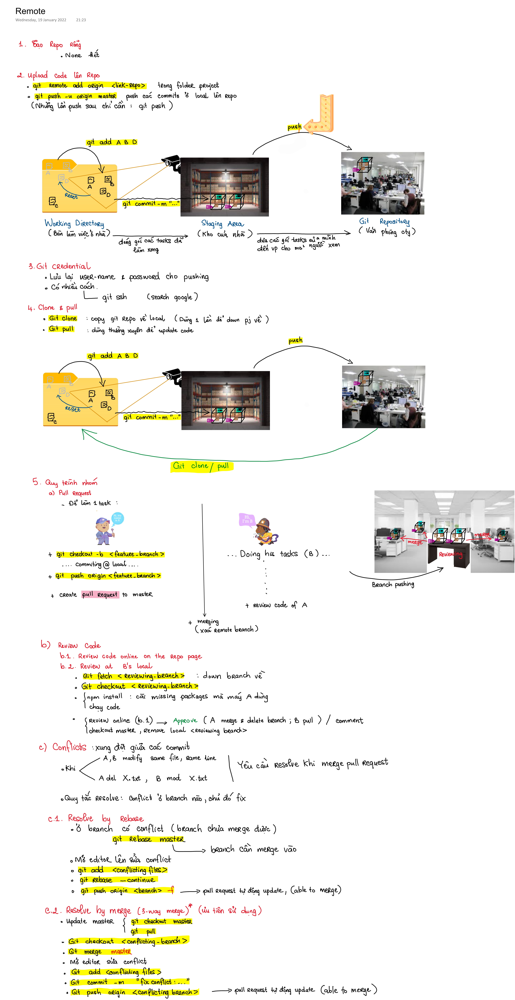

# Local

# Remote

---

# Techniques

## Git stash

- Lưu bộ nhớ tạm (k cần commit) trước khi switch branch...

- `git stash save` để lưu 1 stash.
- `git stash list` để liệt kê các stash đã lưu.
- `git stash apply stash@{stashId}` để lấy lại các thay đổi lưu bởi stash `stash@{stashId}`.
- `git stash drop stash@{stashId}` để xóa bỏ `stash@{stashId}`
